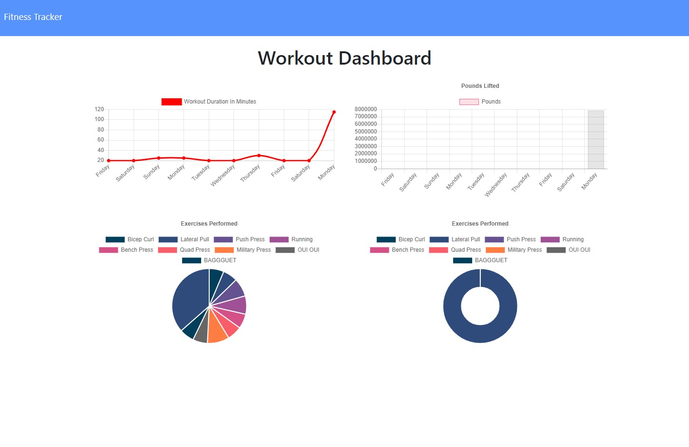

# workout-tracker
A simple workout tracker using Mongo database with a Mongoose schema and routes handled with Express.

## Built With

* [HTML](https://developer.mozilla.org/en-US/docs/Web/HTML)
* [CSS](https://developer.mozilla.org/en-US/docs/Web/CSS)
* [Javascript](https://developer.mozilla.org/en-US/docs/Web/JavaScript)
* [mongoDB](https://www.mongodb.com/)

* [express](https://www.npmjs.com/package/express)
* [mongoose](https://www.npmjs.com/package/mongoose)
* [morgan](https://www.npmjs.com/package/morgan)

## Deployed Link

* [Link to live site]()

## Author

* **May Faucher** 

- [Link to Portfolio Site](https://quiet-lake-79543.herokuapp.com/)
- [Link to Github](https://github.com/DivineMayura)
- [Link to LinkedIn](www.linkedin.com/in/mayfaucher)

## License

This project is licensed under the MIT License 

## Image of Site:

